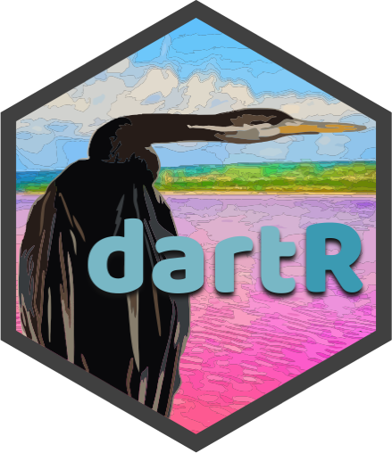
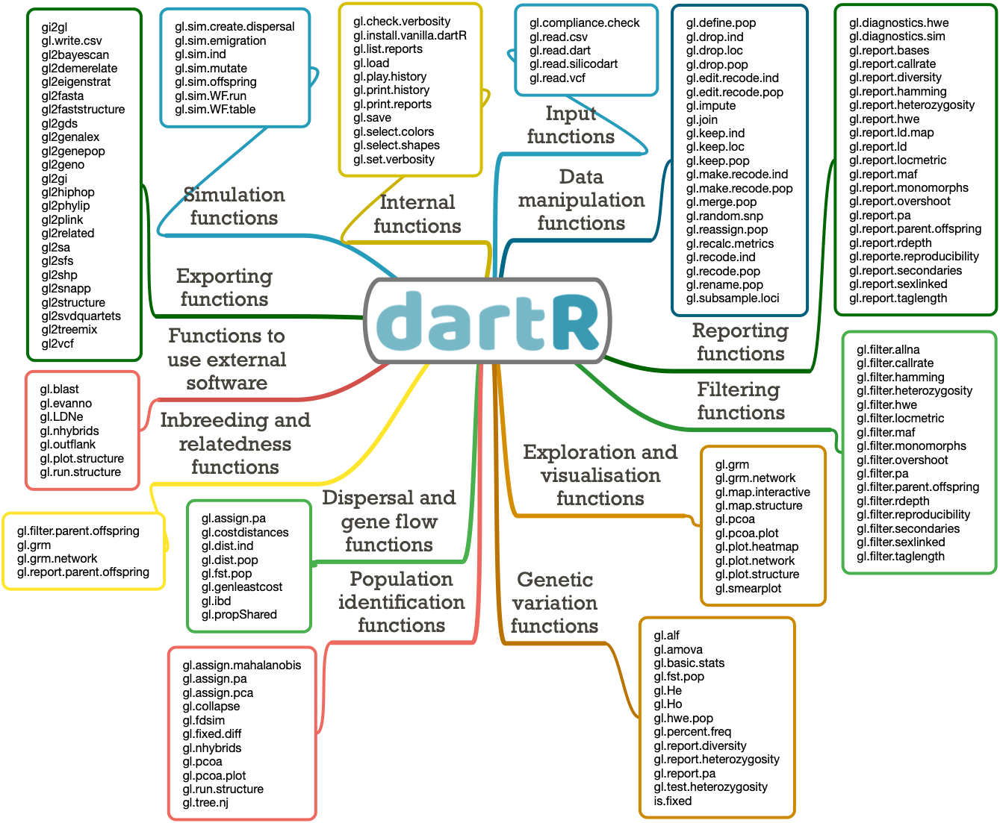

<!-- README.md is generated from README.Rmd. Please edit that file -->


# `dartR` <a href="https://green-striped-gecko.github.io/dartR/"></a>

## An accessible genetic analysis platform for conservation, ecology and agriculture

## This is the legacy version and no longer actively developed. Please upgrade to the [dartRverse](https://github.com/green-striped-gecko/dartRverse) suit of packages

<!-- badges: start -->

Main repository:
[](https://cran.r-project.org/package=dartR)
[](https://cran.r-project.org/web/checks/check_results_dartR.html)
[](https://github.com/green-striped-gecko/dartR/actions)
[](https://github.com/green-striped-gecko/dartR/actions/workflows/R-CMD-check-beta.yaml)
[](https://cran.r-project.org/package=dartR)
[](https://cran.r-project.org/package=dartR)
<!-- badges: end -->

Publication:
[](https://doi.org/10.1111/1755-0998.12745)

Zenodo:
[](https://zenodo.org/badge/latestdoi/86640709)

<!-- badges: start -->

Dev repositories:
[](https://github.com/green-striped-gecko/dartR/actions/workflows/R-CMD-check-dev.yaml)
[](https://github.com/green-striped-gecko/dartR/actions/workflows/R-CMD-check-dev_Arthur.yaml)
[](https://github.com/green-striped-gecko/dartR/actions/workflows/R-CMD-check-dev_Bernd.yaml)
[](https://github.com/green-striped-gecko/dartR/actions/workflows/R-CMD-check-dev_Luis.yaml)
[](https://github.com/green-striped-gecko/dartR/actions/workflows/R-CMD-check-dev_Carlo.yaml)
<!-- badges: end -->

## Overview

`dartR` is a user-friendly R package that delivers a variety of analyses
and pipelines on the same platform, as well as excellent user support
via high-quality tutorials and documentation.

`dartR` is a collaboration between the University of Canberra, CSIRO,

Diversity Arrays Technology and Monash University , and is supported
with funding from the ACT Priority Investment Program, CSIRO and the
University of Canberra.

<p align="center">
    
    
    
    


</p>

## Installation

`dartR` is on CRAN, so to install it simply type:

``` r
install.packages("dartR")
```

Because of CRAN limitations, the default installation does not include
all packages needed to run all the functions; hence, specialised
analyses need the installation of additional packages. The following
code guarantees that all necessary packages for all `dartR` analyses are
set up and ready to go.

``` r
gl.install.vanilla.dartR()
```

You can install the development version of `dartR` from GitHub with:

``` r
gl.install.vanilla.dartR(flavour = "dev")
```

Please consult [this installation
tutorial](https://github.com/green-striped-gecko/dartR/wiki/Installation-tutorial)
if you run into any problems during setup.

## Usage

`dartR` provides several functions for handling all the steps involved
in genetic data analysis, from reading multiple data input formats to
manipulating, filtering, exploring and analysing the data.

<p align="center">

</p>

We use the prefix ‘gl’ in function names to acknowledge the use of the
genlight object from package
[adegenet](https://doi.org/10.1093/bioinformatics/btn129) as our input
format.

In most cases, the following term in the function name indicates a
subset of functions.

Similarly, in most cases the first function parameter (input) is the
genlight object.

For instance, you might use the code below to generate a report and then
filter your data based on the percentage of missing data:

``` r
library(dartR)
test <- platypus.gl
rep <- gl.report.callrate(test)
test_1 <- gl.filter.callrate(test)
```

## Getting started

1.  Are you a R rookie? If you want to learn R and RStudio without any
    fuss, have a look at our [R-refresher
    tutorial](http://georges.biomatix.org/storage/app/media/uploaded-files/Tutorial_1_dartR_RStudio_Refresher_22-Dec-21.pdf).

2.  Let’s get started by reading your genetic data into `dartR`; if you
    have DArT data, follow [this
    tutorial](http://georges.biomatix.org/storage/app/media/uploaded-files/tutorial3adartrdatastructuresandinput22-dec-21-2.pdf);
    if not, follow [this
    one](http://georges.biomatix.org/storage/app/media/uploaded-files/tutorial3bdartrdatastructuresandinputfromsourcesotherthandartlmagv2-2.pdf).

3.  Checking out our [data manipulation
    tutorial](http://georges.biomatix.org/storage/app/media/uploaded-files/tutorial4dartrdatamanipulation22-dec-21-3.pdf)
    is the easiest way to get your feet wet with `dartR`.

4.  [This
    tutorial](http://georges.biomatix.org/storage/app/media/uploaded-files/tutorial5dartrbasicfiltering22-dec-21-2.pdf)
    will provide some pointers on how to filter your data effectively,
    an important step that depends on making sound threshold
    assessments.

5.  Check out our [simulations
    tutorial](https://github.com/green-striped-gecko/dartR/wiki/Simulations-tutorial)
    to learn more about our simulation model, a powerful tool for
    illuminating intricate evolutionary and genetic processes.

6.  In more advanced topics, check our technical notes on [Genetic
    Distances and their Visualization in Population
    Genetics](http://georges.biomatix.org/storage/app/media/uploaded-files/TECHNICAL_NOTE_Genetic_Distance_18-Feb-22.pdf)
    and [Fixed Difference
    Analysis](http://georges.biomatix.org/storage/app/media/uploaded-files/TechNote_fixed_difference_analysis_25-Feb-22.pdf).

## Getting help

1.  Google groups Q&A forum in support of users can be accessed
    [here](https://groups.google.com/g/dartr?pli=1).

2.  The [RStudio community](https://community.rstudio.com/) provides a
    welcoming environment in which to ask any inquiry.

3.  Answers to frequently asked topics may usually be found on [Stack
    Overflow](https://stackoverflow.com/questions/tagged/r).

## Contribute

If you want to help shape the future of `dartR`, [this
tutorial](http://georges.biomatix.org/storage/app/media/uploaded-files/Tutorial_0_dartR_for_the_Developer_2.0_19-Feb-22.pdf)
is for you.

## Citation

Please acknowledge `dartR` if you use it in your study. Copy and paste
the following code to the R console to retrieve the citation
information:

``` r
citation("dartR")
```

Check out our
[articles](https://github.com/green-striped-gecko/dartR/wiki/dartR-team-publications)
and our
[awards](https://github.com/green-striped-gecko/dartR/wiki/dartR-awards).

Have fun working with `dartR`!

Cheers,

Bernd, Arthur, Luis, Carlo, Olly & Diana
